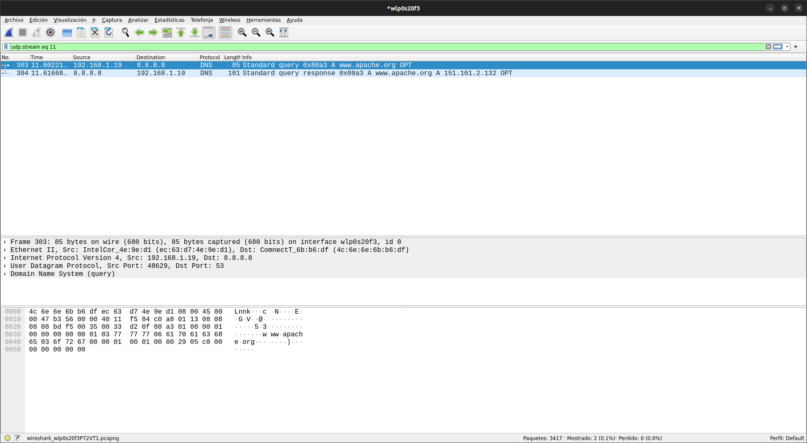
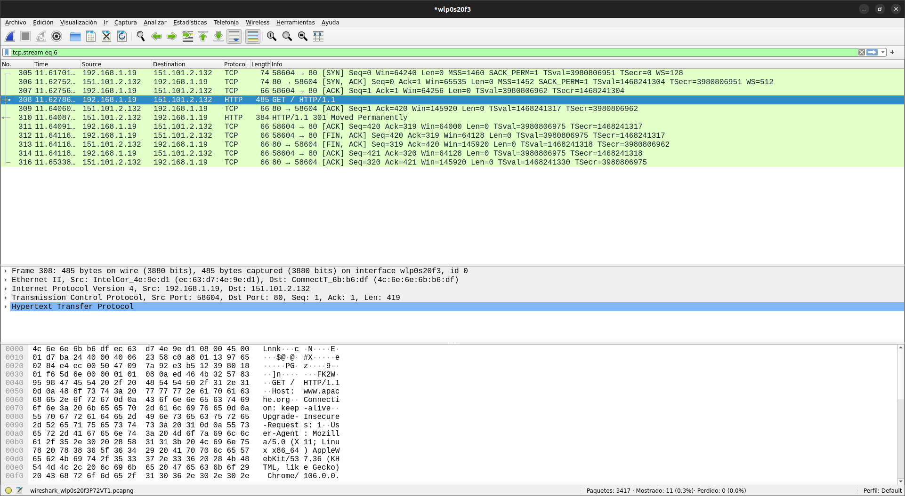

<h1 style="margin-top: 50%">Práctica 1</h1>

## Despliegue de aplicaciones web - DAW2

### Josep Maria Castell Colom

## Parte 1: Puertos y conexiones

Inicia una sesión en Windows con un usuario con privilegios de administrador.

1. Averigua los puertos TCP a la escucha con el comando `netstat –a –p TCP –n`.

> Debido a que el sistema operativo es Ubuntu se ha usado el comando `netstat -atpn` donde `-a` = 'all', `-t` = 'TCP', `-p` = 'program' y `-n` = 'numeric address'.

> Los puertos TCP a la escucha son el `:53`, el `:631`, el `:80`, el `:43973` y el `:51896`.

2. Averigua los puertos UDP a la escucha con el comando netstat `–a –p UDP –n`.

> Al igual que en la anterior pregunta se ha usado un comando distinto; en este caso `netstat -aupn`, `-u` = 'UDP'.

> Observando todos los puertos 'UDP' vemos como ninguno de ellos indica que esté a la escucha:

> Sin embargo, si usamos en su lugar el comando `netstat -lupn`, con la `-l` de 'listening', vemos que algunos de ellos sí aparecen.

> Estos son el :47262, :53, :631, :5353, :546 y :58314.

3. Abre el navegador y accede a una web de internet:

Muestra las conexiones TCP establecidas con el comando `netstat –p TCP –n`.

3.1. ¿Qué puertos ha signado el sistema operativo al navegador web para establecer las conexiones TCP?

> El sistema operativo ha asignado los puertos `:57118` y `:42830` al navegador web.

3.2. ¿Qué puertos utilizan los servidores con los que se establecen las conexiones?

> Todos los servidores utilizan el puerto `:443`.

4. Comprueba la IP y el nombre del servidor predeterminado de DNS con el comando `nslookup`.

> Al parecer el comando `nslookup` funciona de forma distinta dependiendo del sistema operativo. En el caso de _Linux_ si introducimos el comando a secas vemos que se activa el modo interactivo para introducir comandos, pero no nos muestra el nombre del servidor DNS predeterminado:

> Debido a ello es necesario un primer comando que nos informa de la IP del servidor DNS predeterminado (`resolvectl status`), con el cual obtenemos la IP `8.8.4.4` con la cual si realizamos la resolución inversa nos devuelve la URL del servidor: '**dns.google**'.

5. Realiza la resolución inversa de la IP 62.42.63.52, obteniendo el nombre del servidor DNS con el comando `nslookup`.

> La dirección obtenida es: '**resolv2.ono.com**':

## Parte 2: Protocolo HTTP

Descarga e instala el programa WIRESHARK.

Abre el navegador.

Inicia una captura con Wireshark en CAPTURE:INTERFACES:START.

Desde el navegador accede a la web http://www.apache.org.

Accede a Wireshark y para la captura CAPTURE:STOP.

Busca una trama HTP en donde la petición sea GET / HTTP/1.1.

Con el botón derecho del ratón selecciona FOLLOW TCP STREAM.

Responde a las siguientes preguntas mostrando capturas de pantalla con las
evidencias\*:

1. ¿Cuál es tu dirección IP? ¿Y tu puerto de origen?

> La dirección IP del origen es `192.168.1.19` y el puerto de origen el `:58604`.

2. ¿Cuál es la dirección IP de destino? ¿Y el puerto de destino?

> La dirección IP del destino que hemos recibido del servidor DNS es la `151.101.2.132` y el puerto es el `:80`.

3. ¿Qué versión de HTTP se utiliza?

> La versión que se utiliza de HTTP es la 1.1.

4. ¿Qué método de petición se utiliza?

> El método de petición utilizado es el método `GET`.

5. ¿Qué ha ocurrido con la respuesta del servidor? (Adquiere o no adquiere lo que solicita)

> Según el punto de vista se puede decir que adquiere lo que solicita o que no debido a que lo que se recibe es una redirección (estado 301: movido permanentemente); por lo tanto, se adquiere lo que solicita después de ser redirigido pero no en esta petición en concreto (en este caso el estado deberia ser 200: OK).

\* A continuación se incluyen las capturas de pantalla de la comunicación DNS Y TCP/HTTP y una breve explicación del establecimiento de la comunicación y su cierre.

En esta primera imagen se puede ver el intercambio con el servidor DNS.
Éste recibe una petición de la dirección IP de origen solicitando la url 'www.apache.org' y le devuelve la IP solicitada.

Los protocolos usados son:  
DNS -> UDP -> IP -> Eth

En la segunda imagen se aprecia la comunicación TCP con el intercambio de peticiones y respuestas HTTP y el fin de la comunicación TCP.

En primer lugar se ve como se establece la comunicacion con [SYN] - [SYN, ACK] - [ACK].

Después la IP de origen solicita los recursos HTTP y la IP de destino se los entrega.

Para finalizar se cierra la comunicación con [FIN, ACK].

En esta ocasión se usan los protocolos:  
HTTP -> TCP -> IP -> Eth

### **Diagrama de secuencia de la comunicación DNS - TCP/HTTP**

