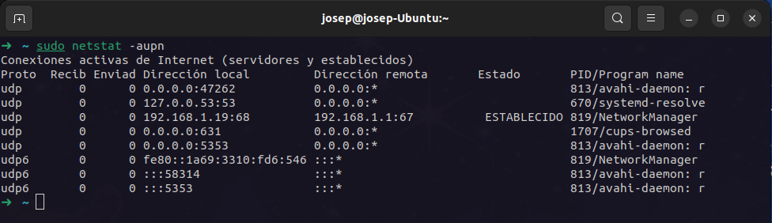

# Práctica 1

## Despliegue de aplicaciones web - DAW2

### Josep Maria Castell Colom

## Parte 1: Puertos y conexiones

Inicia una sesión en Windows con un usuario con privilegios de administrador.

1. Averigua los puertos TCP a la escucha con el comando `netstat –a –p TCP –n`.

> Debido a que el sistema operativo es Ubuntu se ha usado el comando `netstat -atpn` donde `-a` = 'all', `-t` = 'TCP', `-p` = 'program' y `-n` = 'numeric address'.

> Los puertos TCP a la escucha son el :53, el :631, el :80, el :43973 y el :51896.

2. Averigua los puertos UDP a la escucha con el comando netstat `–a –p UDP –n`.

>

3. Abre el navegador y accede a una web de internet:

Muestra las conexiones TCP establecidas con el comando `netstat –p TCP –n`.

3.1. ¿Qué puertos ha signado el sistema operativo al navegador web para establecer las conexiones TCP?

3.2. ¿Qué puertos utilizan los servidores con los que se establecen las conexiones?

4. Comprueba la IP y el nombre del servidor predeterminado de DNS con el comando `nslookup`.

5. Realiza la resolución inversa de la IP 62.42.63.52, obteniendo el nombre del servidor DNS con el comando `nslookup`.

## Parte 2: Protocolo HTTP

Descarga e instala el programa WIRESHARK.

Abre el navegador.

Inicia una captura con Wireshark en CAPTURE:INTERFACES:START.

Desde el navegador accede a la web http://www.apache.org.

Accede a Wireshark y para la captura CAPTURE:STOP.

Busca una trama HTP en donde la petición sea GET / HTTP/1.1.

Con el botón derecho del ratón selecciona FOLLOW TCP STREAM.

Responde a las siguientes preguntas mostrando capturas de pantalla con las
evidencias:

1. ¿Cuál es tu dirección IP? ¿Y tu puerto de origen?

2. ¿Cuál es la dirección IP de destino? ¿Y el puerto de destino?

3. ¿Qué versión de HTTP se utiliza?

4. ¿Qué método de petición se utiliza?

5. ¿Qué ha ocurrido con la respuesta del servidor? (Adquiere o no adquiere lo que solicita)
