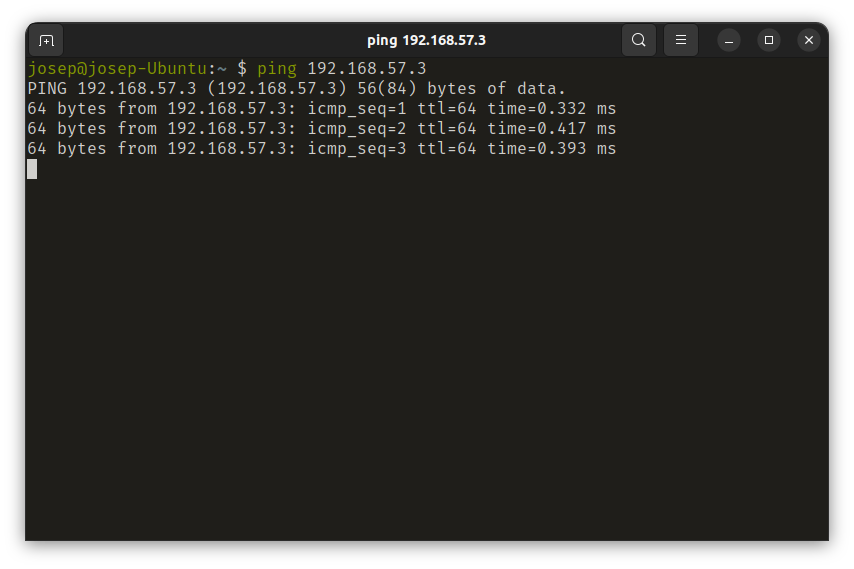

<style>
  code {
    font-weight: bolder;
    font-family: 'Fira Code', 'Ubuntu Mono', monospace;
  }

  img {
    margin: 0 auto;
  }

  .small-img {
    max-width: 200px;
  }

  .medium-img {
    max-width: 500px;
  }

  .rounded-border {
    border-radius: 10px 10px 0 0;
  }

  .center {
    width: 100%;
    text-align: center;
  }

  .page-break {
    page-break-after: always;
  }
</style>

<h1 style="margin-top: 50%">Práctica 2</h1>

## Despliegue de aplicaciones web - DAW2

### Josep Maria Castell Colom

<div class="page-break"></div>

## 1. Descarga e instalación de una máquina virtual Ubuntu Server

Desde un equipo Windows descarga una VM Ubuntu Server explicando y detallando de forma suficiente y representativa los pasos (no importa realizar capturas de todo).

1. El primer paso a realizar es la descarga de la imágen de la máquina virtual. Para ello, hay que dirigirse a la [página de Ubuntu](https://ubuntu.com) y, en la pestaña '*Download*', seleccionar '*Ubuntu Server*' y pulsar el botón '*Download Ubuntu Server 22.04.1 LTS*'.

2. A continuación hay que abrir la aplicación **Virtual Box** y en la barra de herramientas seleccionar *Máquina > Nueva* (o pulsar 'Ctrl-n').

  - En el campo nombre hay que establecer un nombre; en nuestro caso usaremos 'ubuntu-server'.  
  - Seleccionar la carpeta donde se instalará la máquina virtual. Para este ejemplo usaremos la carpeta por defecto (`/home/usuario/VirtualBox VMs`).
  - Por último hay que elegir el tipo de sistema operativo y la versión. Estableceremos tipo: 'Linux' y versión 'Ubuntu (64-bit)' aunque esta elección no tiene demasiada importancia ya que vamos a montar la imagen Ubuntu Server que hemos descargado.
  - Al pulsar el botón 'Siguiente' toca seleccionar el tamaño de la memoria RAM. Los 4MB que vienen seleccionados por defecto son suficientes para esta práctica.
  - En el siguiente paso hay varias opciones sobre la creación del disco duro virtual. Dejaremos la opción por defecto 'Crear un disco duro virtual ahora' y pulsamos el botón 'Crear'.
  - En la siguiente ventana hay que especificar el tipo de disco duro y usaremos el tipo que viene por defecto 'VDI (VirtualBox Disk Image). Pulsamos 'Siguiente'.
  - La siguiente opción es para especificar si el disco duro virtual es de tamaño fijo o dinámico. Como no tiene demasiada importancia para esta práctica, usaremos la opción por defecto ('Reservado dinámicamente'). 'Siguiente'.
  - A continuación, se pide la ubicación y el tamaño del archivo de unidad de disco duro virtual. Usaremos la ubicación y el tamaño por defecto y pulsamos en 'Crear'.

3. En este punto la máquina virtual está preparada para arrancar aunque hay que hacer un último paso antes de la configuración de red; y éste es insertar la imágen descargada de 'Ubuntu Server' en la unidad óptica (virtualmente hablando, claro).

  - Para ello hay que seleccionar la nueva máquina ('ubuntu-server' en nuestro caso) y pulsar el botón de 'Configuración' representado con un engranaje o pulsar sobre la máquina virtual con el botón derecho del ratón y seleccionar 'Configuración' (o pulsar 'Ctrl-s').  
  - En la interfaz de 'Configuración' hay que seleccionar la pestaña 'Almacenamiento' en el campo de la izquierda.
  - Dentro de esta pestaña, en el campo llamado 'Dispositivos de almacenamiento' seleccionamos el 'Controlador: IDE' existente que pone 'Vacío'.  
  - En el campo de la derecha, en el apartado 'Atributos' hay que pulsar el botón con forma de disco situado a la derecha del desplegable ('Unidad óptica'). En la ventana emergente hay que seleccionar 'Seleccionar un archivo de disco'. Buscamos en nuestro equipo el archivo de imagen descargado (`.iso`); en nuestro caso se encuentra en la carpeta de descargas, y pulsamos 'Abrir'.  
  - Para finalizar, pulsamos el botón 'Aceptar'.

Este útimo punto (3) sirve para arrancar la nueva máquina virtual con la imagen 'Ubuntu Server' descargada.

## 2. Configuración de la máquina virtual y comprobación de la conectividad *host-VM*

Configura la VM según lo expuesto anteriormente y verifica que existe conectividad
entre el usuario windows y la vm, mediante los el comando ping entre windows y vm y
la vm y windows. Activa la VM Ubuntu server y abre un navegador web en el usuario
windows y accede a la dirección web del Ubuntu Server. Pon capturas del proceso.

### 1. Configuración de la red

En este apartado se explicará la configuración de la red interna previa a la inicialización de la máquina. Para ello se seguirán los pasos detallados a continuación:

1. Antes de configurar la red de la nueva máquina virtual hay que crear una red 'sólo-anfitrión' para poder seleccionarla posteriormente en la configuración de red de la máquina. Para este fin nos dirigimos a *Archivo > Administrador de red de anfitrión* (o 'Ctrl-h'). En la ventana que se abrirá pulsamos 'Crear' y ya se puede cerrar.

2. Posteriormente, hay que abrir de nuevo la ventana de 'Configuración' de la nueva máquina virtual y dirigirse a la pestaña 'Red'.

3. En el apartado 'Red' se pueden ver cuatro pestañas con adaptadores. Hay que dejar el 'Adaptador 1' como viene por defecto y cofigurar el 'Adaptador 2' de la siguiente manera:  

- Marcar la casilla 'Habilitar adaptador de red'.
- En el desplegable 'Conectado a' seleccionar 'Adaptador sólo-anfitrión'.
- Vemos como en 'Nombre' aparece el nombre de la red de anfitrión que creamos en el paso 1.
- 'Aceptar'.

### 2. Inicialización de la máquina virtual y configuración del sistema operativo

Como la instalación de Ubuntu Server es bastante sencilla, se expondrá a continuación un breve resumen de los pasos haciendo hincapié en aquellos donde sea necesario una configuración personalizada.

1. Para iniciar la máquina hay que tenerla seleccionada en el panel izquierdo de **Virtual Box** y pulsar sobre el botón 'Iniciar' (flecha verde) o pulsar con el botón derecho del ratón sobre la máquina virtual y pulsar *Iniciar > Inicio normal*.

<div class="page-break"></div>

2. En caso de que sea requerido la selección de un disco de inicio, se debe seleccionar la imagen descargada:

<div class="center">
  
</div>

3. Seleccionar la opción '*Try or Install Ubuntu Server*'. Se iniciará el sistema operativo.

4. Las siguientes opciones son relativas al idioma del sistema y configuración del teclado.

5. Es suficiente con continuar con las opciones que vienen por defecto.

6. Solo queda introducir la información relativa al nombre de usuario y del servidor y establecer la contraseña.

7. Seleccionar 'Done' con las opciones por defecto hasta que se realice la instalación.

8. Cuando termine la instalación y se haya iniciado sesión con el nombre de usuario y la contraseña establecidos ya nos encontraremos dentro de la nueva máquina. En este punto es recomendable actualizar los paquetes con los comandos:

    ```bash
      sudo apt-get update   
      sudo apt-get upgrade
    ```

<div class="page-break"></div>

### 3. Comprobación de la conectividad *host-VM*

1. Para finalizar esta parte del ejercicio se debe obtener la dirección IP interna de la máquina virtual con el comando `ip -4 addr`. La encontraremos en la sección con el nombre de la red de anfitrión creada en **Virtual Box** (en nuestro caso 'vboxnet0') precedida por `inet`.

> 3: vboxnet0: <BROADCAST,MULTICAST,UP,LOWER_UP> mtu 1500 qdisc fq_codel state UP group default qlen 1000  
  inet 192.168.57.3/24 brd 192.168.57.255 scope global vboxnet0
       valid_lft forever preferred_lft forever

2. Una vez obtenida la IP interna de la máquina virtual, abrimos una terminal en la máquina anfitrión e introducimos el comando `ping <IP máquina virtual>`. En nuestro caso:

    ```bash
      ping 192.168.57.3
    ```

3. Si todo ha ido bien deben aparecer los paquetes que se van enviado a la IP:

<div class="center">
  
</div>

4. Hay que repetir el proceso inversamente, es decir, buscar la IP del *host* y hacer *ping* desde la máquina virtual a la IP del *host*. Se debería obtener el mismo resultado exceptuando la dirección IP:

<div class="center">
  
</div>

5. El último paso de esta sección es instalar el servidor 'Apache HTTP Server' en la máquina virtual; usando el comando:

    ```bash
      sudo apt-get install apache2
    ```

    Esto instalará el servidor web 'Apache' y lo iniciará directamente. Por lo que si usamos el comando `service apache2 status` deberia salir que está siendo ejecutado.

<div class="center">
  
</div>

6. Por último hay que abrir una nueva ventana del navegador en la máquina anfitrión e introducir en el campo de la URL la dirección IP interna de la máquina virtual. Lo que debería mostrar la página de bienvenida del servidor 'Apache':


## 3. Captura de paquetes con Wireshark

Abre el Wireshark e inicia la captura de paquetes. Repite el proceso anterior y
después finaliza de caputar paquetes en el Wireshark. Busca los paquetes
correspondientes al tráfico entre el usuario Windows y la VM.