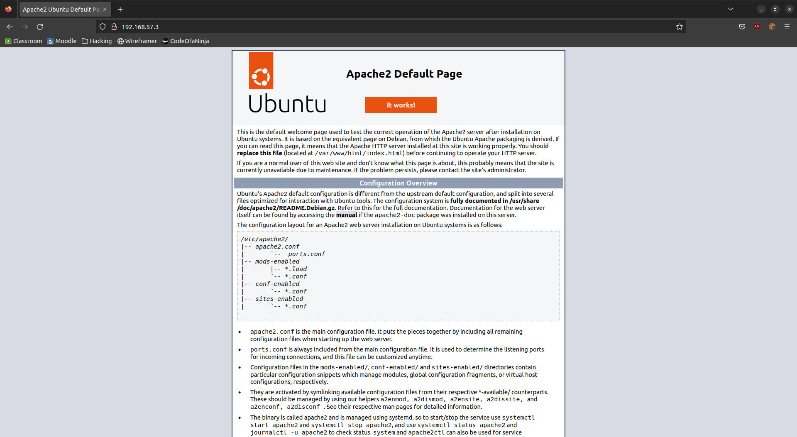

<style>
  code {
    font-weight: bolder;
    font-family: 'Fira Code', 'Ubuntu Mono', monospace;
  }

  img {
    margin: 0 auto;
  }

  .small-img {
    max-width: 200px;
  }

  .medium-img {
    max-width: 500px;
  }

  .rounded-border {
    border-radius: 10px 10px 0 0;
  }

  .center {
    width: 100%;
    text-align: center;
  }

  .page-break {
    page-break-after: always;
  }
</style>

<h1 style="margin-top: 50%">Práctica 3</h1>

## Despliegue de aplicaciones web - DAW2

### Josep Maria Castell Colom

<div class="page-break"></div>

## 1. Descarga el servidor HTTP Apache

Para instalar el servidor _HTTP Apache_ hay que ejecutar el comando:

```bash
sudo apt install apache2
```

<div class="center">
  
</div>

## 2. Verifica que se ha instalado correctamente y el servidor está activo

Como ya estaba instalado de la práctica anterior es suficiente con comprobar que está activo con el comando:

```bash
service apache2 status
```

<div class="center">
  
</div>

## 3. Navega hasta el directorio de configuración de Apache y muestra todo el contenido del mismo

El archivo de configuración de Apache se encuentra en la ruta `/etc/apache2` por lo que hay que introducir el comando:

```bash
cd /etc/apache2
```

Para mostrar el contenido se puede usar `ls`, en este caso vamos a usar:

```bash
ls -la
```

La opción `-l` sirve para mostrar más información de cada archivo/directorio y la opción `-a` sirve para mostrar los archivos ocultos.

<div class="center">
  
</div>

## 4. Copia el archivo de configuración Apache para realizar una copia de seguridad. Dale el nombre apache2_copia. Luego muestra los contenidos del directorio para verificar que se ha creado.

El archivo de configuración de Apache es `apache2.conf`, para copiarlo se usa el comando `cp` seguido del nombre/ruta del archivo a copiar y en segundo lugar se indica el nombre/ruta del archivo copiado. El comando resultante es:

```bash
cp apache2.conf apache2_copia.conf
```

<div class="center">
  
</div>

## 5. Entra dentro de la edición del fichero apache2.conf.

Para editar un archivo de texto se pueden usar diferentes aplicaciones; en nuestro caso usaremos 'Vim'.  
Para abrir el mencionado editor de texto se usa el comando `vim` si añades a continuación un nombre de archivo abre ese archivo o lo crea si no existe.

```bash
vim apache2.conf
```

## 6. Pon una captura de pantalla estando dentro de la edición del fichero apache2.conf donde se muestre la jerarquía de configuración del directorio `/etc/apache2`.

<div class="center">
  
</div>

## 7. Desde el navegador web de tu máquina accede al servidor Apache. Pon una captura de pantalla del resultado.

Primero hay que comprobar la dirección IP de la máquina virtual con el comando:

```bash
ip -4 addr
```

<div class="center">
  
</div>

Seguidamente, en la máquina anfitrión abrimos una ventana del navegador y accedemos a esa IP:



## 8. En la sección Document Roots del apartado anterior se indica el directorio en el que se encuentran el archivo de configuración de la página. Muévete del directorio actual a ese directorio. Pon capturas del proceso.

Si observamos la página web por defecto de Apache se puede observar que la ruta hacia el archivo que carga la página se encuentra en `/var/www/html/index.html` por lo que usaremos:

```bash
cd /var/www/html
```

<div class="center">
  
</div>

## 9. Muestra el contenido del directorio y luego accede al archivo de configuración de la página web de Apache.

Como ya hemos explicado, mostrar el contenido:

```bash
ls -la
```

<div class="center">
  
</div>

Editar el archivo html:

```bash
vim index.html
```

<div class="center">
  
</div>

## 10. Modifica el archivo de configuración para que el título sea Servidor Apache DAW. Guarda los cambios y accede al navegador web para visualizarlos.

El título de la página se encuentra dentro del 'head' entre las etiquetas 'title'.  
Lo modificamos con el contenido indicado y guardamos el archivo.


